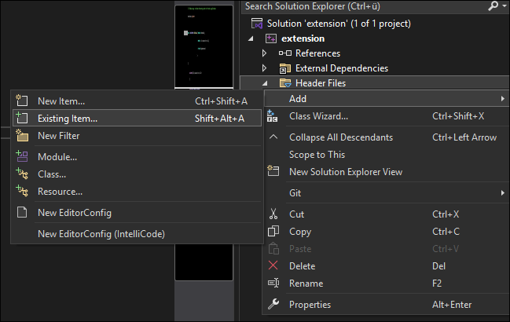
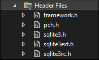

# sqlite_extension
A sqlite extension that sleeps 5 seconds links a dummy funciton `rot13` and calls a revshell :D

# Create a new windows c++ dynamic link library (DLL)


get the sqlite header files
```
wget https://www.sqlite.org/2025/sqlite-autoconf-3510100.tar.gz -o sqlite.tar.gz
```
--> extract the files and link the header
--> put it in the root folder



```
sqlite3.h
sqlite3ext.h
sqlite3rc.h
```




https://sqlite.org/loadext.html

--> change the init funciton name
```
- sqlite3_extension_init
+ sqlite3_[basename]_init
```
where basename is:
```
myextension.dll
[basename].dll
```
Or call another entry point

# Testing
You can test the dll by modifying the `extension/test/test.py` and putting the new dll inside the same folder. 

# Calling

--> second argument is the entry point function 
```
SELECT load_extension('static/assets/images/blog/mydll3.dll', 'sqlite3_mydll3_init');
```

if it has the calling convension you can leave it empty
```
SELECT load_extension('static/assets/images/blog/mydll3.dll');
```

```
SELECT rot13("testdata") as data;
```